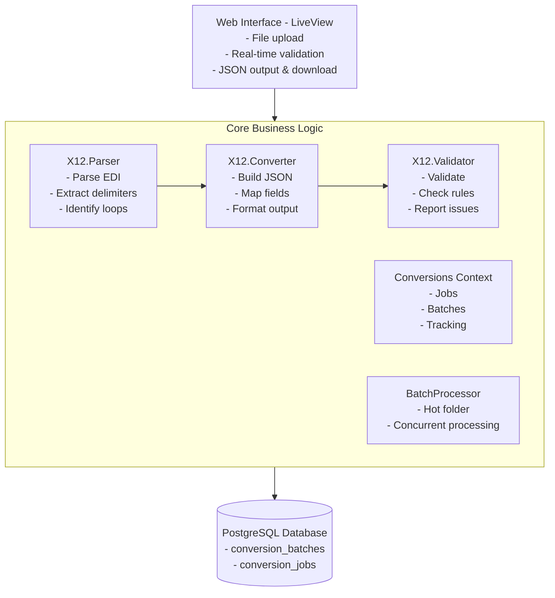
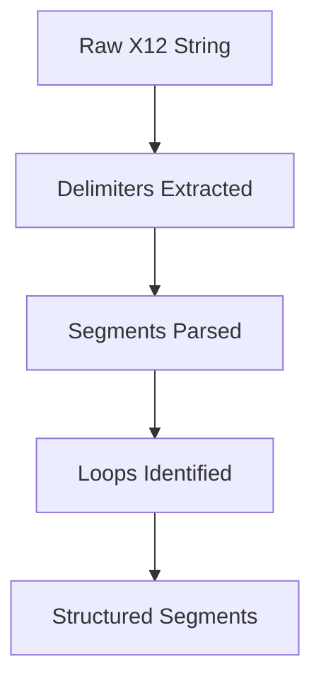
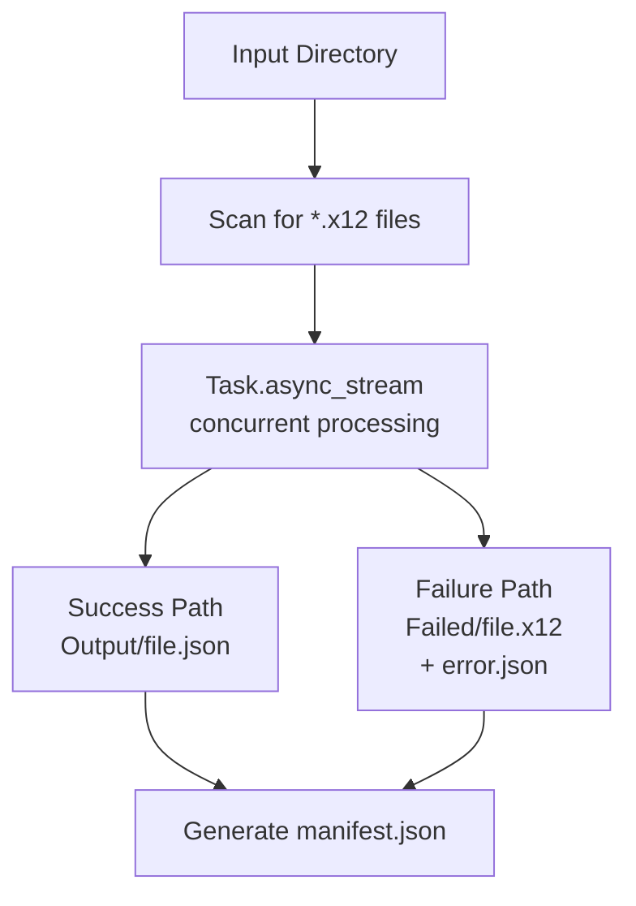
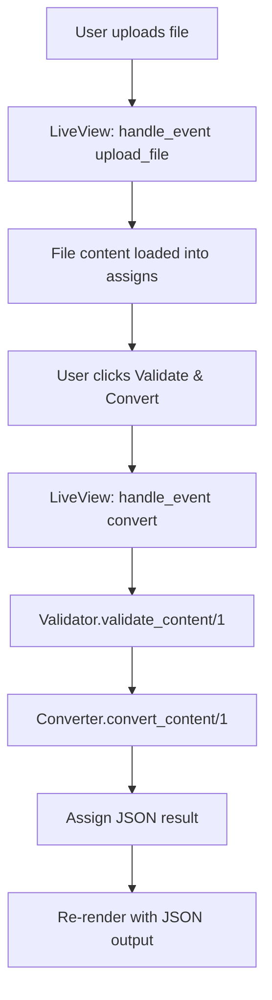
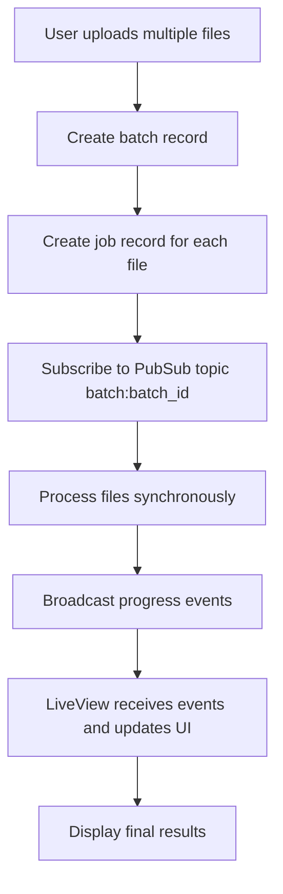
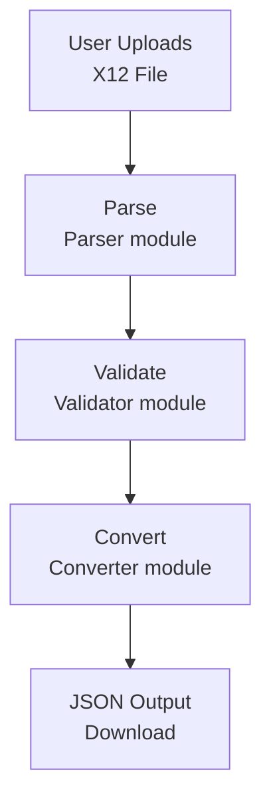
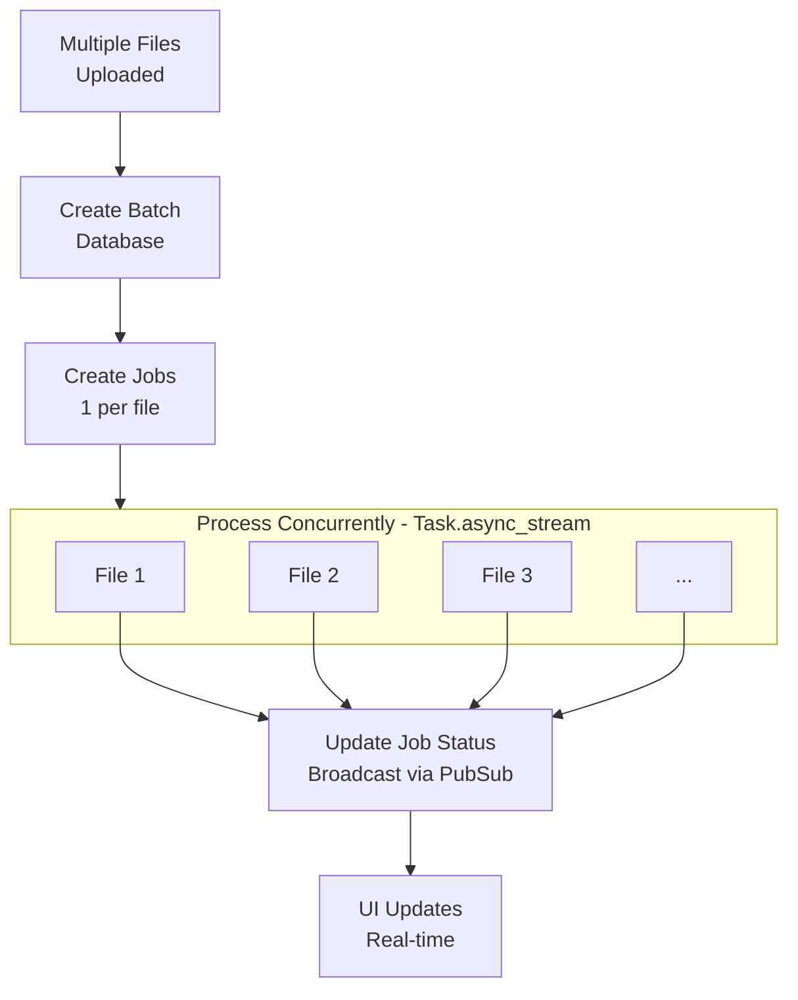

# X12Bridge Architecture

A simple, focused architecture for converting X12 EDI files to JSON.

---

## Overview

X12Bridge is a **single-purpose application** that converts X12 837 healthcare claim files into semantic JSON. It deliberately avoids feature creep and stays focused on translation.

### What X12Bridge Does

✓ Parse X12 EDI files
✓ Validate X12 structure and content
✓ Convert to hierarchical JSON
✓ Track batch processing jobs
✓ Provide real-time web interface

### What X12Bridge Does NOT Do

✗ Provider lookup or validation
✗ Fraud detection
✗ Payment processing
✗ Complete claims processing system

---

## High-Level Architecture



---

## Technology Stack

| Layer | Technology | Purpose |
|-------|------------|---------|
| **Language** | Elixir 1.15+ | Functional programming, pattern matching |
| **Web Framework** | Phoenix 1.8+ | HTTP server, routing |
| **Real-time UI** | Phoenix LiveView | Interactive interface without JavaScript frameworks |
| **Database** | PostgreSQL 14+ | Job tracking, batch management |
| **ORM** | Ecto 3.13+ | Database queries, migrations |
| **HTTP Server** | Bandit | Modern Elixir HTTP server |
| **CSS** | Tailwind CSS | Utility-first styling |
| **JSON** | Jason | Fast JSON encoding/decoding |

---

## Core Modules

### 1. X12.Parser

**Purpose**: Low-level X12 parsing utilities

**Responsibilities**:
- Extract delimiters from ISA segment (`*`, `:`, `~`)
- Split X12 content into segments
- Parse elements within segments
- Identify hierarchical loops (2300 claim, 2400 service lines)
- Extract envelope information (ISA/GS/ST headers)

**Key Functions**:
```elixir
parse/1               # Main entry point
parse_delimiters/1    # Extract delimiters
parse_segments/2      # Split into segments
identify_loops/1      # Build hierarchy
get_element/2         # Extract element values
```

**Data Flow**:



---

### 2. X12.Converter

**Purpose**: Convert X12 to semantic JSON

**Responsibilities**:
- Build hierarchical JSON structure
- Extract transaction metadata
- Map claims with service lines
- Handle 837P (Professional), 837I (Institutional), 837D (Dental)
- Format dates, amounts, and codes
- Extract entities (providers, subscribers, patients)

**Key Functions**:
```elixir
convert_content/1     # Main conversion
build_structure/2     # Build JSON structure
extract_claim/2       # Extract claim data
extract_service_line/2 # Extract service line data
```

**Output Structure**:
```json
{
  "transaction": { ... },    // File metadata
  "claims": [ ... ],         // Claim array
  "summary": { ... }         // Statistics
}
```

---

### 3. X12.Validator

**Purpose**: Comprehensive X12 validation

**Responsibilities**:
- Structural validation (segments, envelopes)
- Syntactical validation (data types, formats)
- Business rules validation (required entities, totals)
- Three-level issue reporting (error, warning, info)

**Validation Categories**:

1. **Structural**
   - ISA segment format (106+ bytes)
   - Valid segment identifiers
   - Sufficient elements per segment

2. **Envelopes**
   - ISA/IEA control number matching
   - GS/GE control number matching
   - ST/SE control number matching
   - Segment count accuracy

3. **Syntactical**
   - NM1: Valid entity codes and types
   - CLM: Positive claim amounts
   - DTP: Valid date formats (CCYYMMDD)
   - HI: Diagnosis code presence

4. **Business Rules**
   - Required entities present (Billing Provider, Subscriber, Claim)
   - Claim total matches service line sum

**Key Functions**:
```elixir
validate_content/1    # Main validation
validate_structure/2  # Structure checks
validate_envelopes/2  # Envelope checks
validate_segments/3   # Segment content checks
validate_business_rules/2 # Business logic checks
```

---

### 4. Conversions Context

**Purpose**: Manage batches and conversion jobs

**Responsibilities**:
- CRUD operations for batches and jobs
- Track conversion status
- Store JSON results in database
- Broadcast real-time updates via PubSub
- Synchronous file processing

**Database Schema**:

```elixir
# Batch
%Batch{
  id: UUID,
  name: String,
  total_files: Integer,
  completed_files: Integer,
  failed_files: Integer,
  status: "pending" | "processing" | "completed",
  jobs: [%Job{}]
}

# Job
%Job{
  id: UUID,
  batch_id: UUID,
  original_filename: String,
  file_size: Integer,
  status: "pending" | "processing" | "completed" | "failed",
  json_result: String (JSONB),
  error_message: String,
  processing_time_ms: Integer,
  progress: Integer (0-100)
}
```

**PubSub Events**:
```elixir
{:job_completed, job_id, "completed"}
{:batch_completed, batch_id}
```

---

### 5. BatchProcessor

**Purpose**: Hot folder batch processing

**Responsibilities**:
- Scan input directory for X12 files
- Process files concurrently using `Task.async_stream`
- Route successful conversions to output directory
- Route failed files to failed directory with error reports
- Generate batch manifest (JSON summary)
- Handle timeouts and crashes gracefully

**Configuration**:
```elixir
config :x12_bridge, :batch_processor,
  input_dir: "priv/batch_processing/input",
  output_dir: "priv/batch_processing/output",
  failed_dir: "priv/batch_processing/failed",
  max_concurrency: 10,
  timeout_per_file_ms: 30_000
```

**Processing Flow**:



---

## Web Interface (LiveView)

### ConverterLive

**Route**: `/converter`

**Features**:
- File upload (drag-and-drop)
- Sample file loading (837P, 837I, 837D)
- Real-time validation
- JSON conversion
- Download and copy functionality

**Event Flow**:



### BatchLive

**Route**: `/batch`

**Features**:
- Multi-file upload
- Real-time progress tracking
- Job status monitoring
- PubSub subscription for updates

**Event Flow**:



---

## Data Flow

### Single File Conversion



### Batch Processing



---

## Concurrency Model

X12Bridge leverages Elixir's concurrency primitives:

### Task.async_stream

Batch processing uses `Task.async_stream` for concurrent file processing:

```elixir
files
|> Task.async_stream(
  fn file -> process_single_file(file, batch_id, config) end,
  max_concurrency: 10,
  timeout: 30_000,
  on_timeout: :kill_task
)
|> Enum.map(fn {:ok, result} -> result end)
```

**Benefits**:
- Controlled concurrency (max 10 files at once)
- Automatic timeout handling
- Backpressure management
- Fault tolerance (one file failure doesn't stop batch)

### Phoenix PubSub

Real-time updates using publish/subscribe:

```elixir
# Subscribe in LiveView
Phoenix.PubSub.subscribe(X12Bridge.PubSub, "batch:#{batch_id}")

# Broadcast from worker
Phoenix.PubSub.broadcast(
  X12Bridge.PubSub,
  "batch:#{batch_id}",
  {:job_completed, job_id, "completed"}
)

# Receive in LiveView
def handle_info({:job_completed, job_id, status}, socket) do
  # Update UI
end
```

---

## Design Principles

### 1. Single Responsibility

Each module has one clear purpose:
- **Parser**: Parse X12
- **Converter**: Build JSON
- **Validator**: Check validity

### 2. Functional Programming

- Immutable data structures
- Pure functions where possible
- Pattern matching for control flow
- Pipelines for data transformation

Example:
```elixir
content
|> Parser.parse()
|> case do
  {:ok, %{segments: segments}} ->
    segments
    |> Parser.identify_loops()
    |> Enum.map(&extract_claim/1)
  {:error, reason} ->
    {:error, reason}
end
```

### 3. Error Handling

Consistent use of `{:ok, result}` / `{:error, reason}` tuples:

```elixir
case Converter.convert_content(x12) do
  {:ok, json} ->
    # Handle success
  {:error, reason} ->
    # Handle error
end
```

### 4. Keep It Simple (YAGNI)

- No premature optimization
- No feature creep
- Build what's needed, not what might be needed
- Simple Phoenix app structure (not umbrella)

### 5. Explicit over Implicit

- Clear function names (`parse_delimiters` not `extract`)
- Explicit parameters (no hidden state)
- Named structs (`%Segment{}` not bare maps)

---

## Performance Considerations

### Memory

- **Parser loads entire file** into memory
- Monitor for files > 10MB
- Consider streaming for very large files (future enhancement)

### Concurrency

- Batch processing uses `max_concurrency: 10`
- Adjust based on available CPU cores
- Database connection pool size: 10 connections

### Database

- JSONB column for storing converted JSON (efficient queries)
- Indexes on:
  - `batch_id` for jobs (fast joins)
  - `status` for filtering

---

## Testing Strategy

### Unit Tests

Test individual modules in isolation:
- `parser_test.exs` - Parser functions
- `validator_test.exs` - Validation rules
- `batch_processor_test.exs` - Batch processing logic

### Integration Tests

Test end-to-end workflows:
- File upload → conversion → JSON output
- Batch processing → multiple files

### Test Data

Located in `test/fixtures/x12/`:
- **Automated tests**: `automated_test_data/` - 6 files for unit testing (001_837p_valid.x12, 002_837i_valid.x12, 003_837d_valid.x12, 004_837p_multi.x12, 005_837p_error.x12, manifest.json)
- **Manual testing**: `manual_test_data/archives/` - ZIP archives of real X12 data from production sources

---

## Future Enhancements (Not Implemented)

The following are **not currently implemented** but planned:

1. **User Authentication**
   - Guardian JWT authentication
   - User accounts and sessions

2. **Subscription Management**
   - Tiered pricing (Free, Starter, Professional, Business)
   - Usage limits and tracking
   - Payment integration

3. **API Access**
   - RESTful API endpoints
   - API key authentication
   - Webhooks for batch completion

4. **Background Jobs**
   - Oban for async processing
   - Email notifications
   - Scheduled jobs

5. **Production Features**
   - Rate limiting
   - File size limits by tier
   - Usage analytics
   - SLA monitoring

---

## Comparison to Similar Tools

| Feature | X12Bridge | Stedi | X12 Parser (Python) |
|---------|-----------|-------|---------------------|
| **Price** | Open source (free) | $0.01-0.05/transaction | Open source |
| **Focus** | 837 claims only | All X12 types | All X12 types |
| **Output** | Semantic JSON | Various formats | Flat structures |
| **Interface** | Web + API (future) | API only | CLI/Library |
| **Deployment** | Self-hosted | SaaS | Library |

**X12Bridge Advantage**: Free, focused, semantic JSON output, self-hosted privacy

---

## Related Documentation

- [API Reference](API_REFERENCE.md) - Module and function documentation
- [User Guide](USER_GUIDE.md) - How to use the web interface
- [Setup Guide](SETUP.md) - Installation instructions
- [CLAUDE.md](../CLAUDE.md) - Original project planning document

---

**Version:** 1.0
**Last Updated:** January 2025
