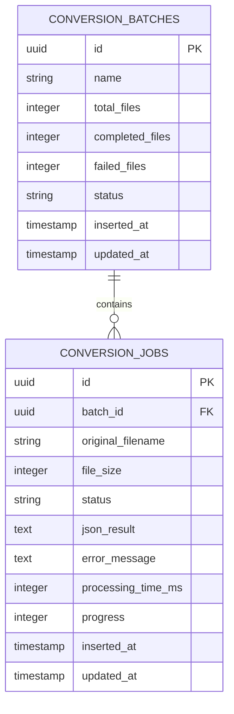
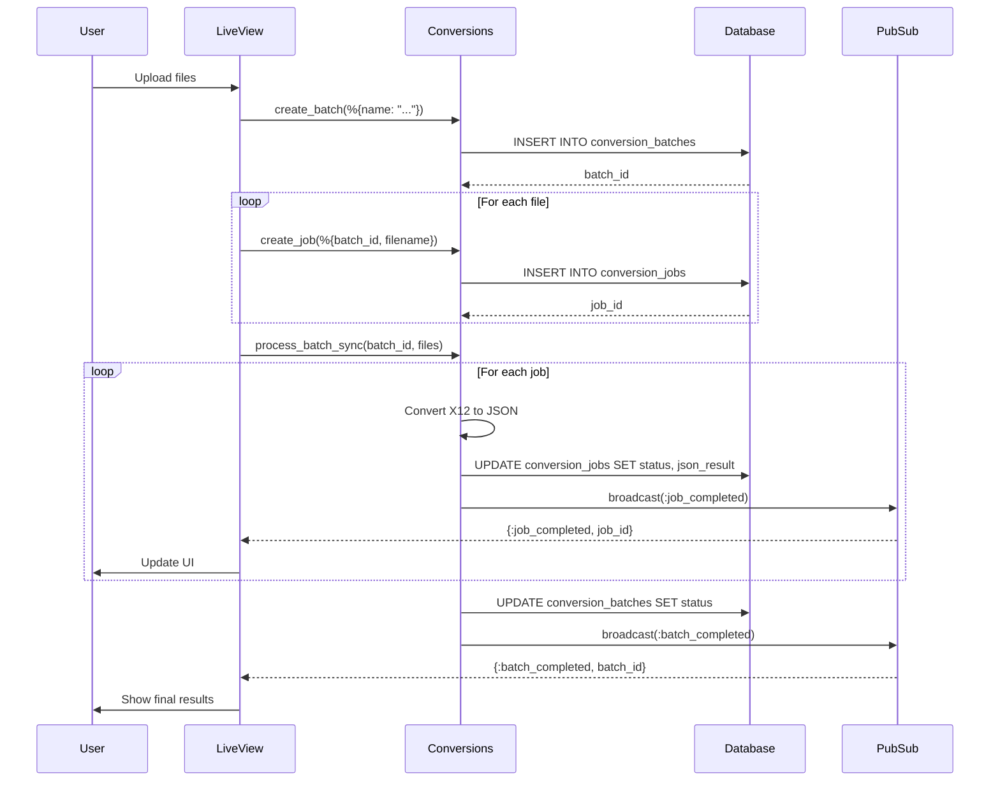

# Database Documentation

Complete guide to X12Bridge database schema, migrations, and data flow.

---

## Entity Relationship Diagram



**For GitHub/VSCode:** The Mermaid diagram above renders automatically in markdown viewers.

---

## DBML Schema (for dbdiagram.io)

Use this at [dbdiagram.io](https://dbdiagram.io) for interactive database design and SQL export.

```dbml
Table conversion_batches {
  id varchar [primary key]
  name varchar
  total_files integer
  completed_files integer
  failed_files integer
  status varchar
  inserted_at timestamp
  updated_at timestamp
}

Table conversion_jobs {
  id varchar [primary key]
  batch_id varchar [ref: > conversion_batches.id]
  original_filename varchar
  file_size integer
  status varchar
  json_result text
  error_message text
  processing_time_ms integer
  progress integer
  inserted_at timestamp
  updated_at timestamp
}
```

**To use:**
1. Copy the DBML code above
2. Go to [dbdiagram.io](https://dbdiagram.io)
3. Paste into the editor
4. View interactive diagram
5. Export to SQL, PDF, or PNG

---

## Tables

### conversion_batches

Tracks groups of files being processed together.

| Column | Type | Constraints | Description |
|--------|------|-------------|-------------|
| `id` | UUID | PRIMARY KEY | Unique batch identifier |
| `name` | VARCHAR(255) | | Batch name (e.g., "Morning Batch 2025-01-03") |
| `total_files` | INTEGER | DEFAULT 0 | Total number of files in batch |
| `completed_files` | INTEGER | DEFAULT 0 | Number of successfully processed files |
| `failed_files` | INTEGER | DEFAULT 0 | Number of failed files |
| `status` | VARCHAR(50) | | "pending", "processing", or "completed" |
| `inserted_at` | TIMESTAMP | NOT NULL | When batch was created |
| `updated_at` | TIMESTAMP | NOT NULL | Last update time |

**Indexes:**
- Primary key on `id`

**Example Row:**
```elixir
%Batch{
  id: "550e8400-e29b-41d4-a716-446655440000",
  name: "Batch 2025-01-03 09:00",
  total_files: 10,
  completed_files: 8,
  failed_files: 2,
  status: "completed",
  inserted_at: ~N[2025-01-03 09:00:00],
  updated_at: ~N[2025-01-03 09:05:23]
}
```

---

### conversion_jobs

Tracks individual file conversions within batches.

| Column | Type | Constraints | Description |
|--------|------|-------------|-------------|
| `id` | UUID | PRIMARY KEY | Unique job identifier |
| `batch_id` | UUID | FOREIGN KEY | References `conversion_batches.id` |
| `original_filename` | VARCHAR(255) | NOT NULL | Original X12 filename |
| `file_size` | INTEGER | | File size in bytes |
| `status` | VARCHAR(50) | | "pending", "processing", "completed", or "failed" |
| `json_result` | TEXT | | Converted JSON output (stored as text) |
| `error_message` | TEXT | | Error details if failed |
| `processing_time_ms` | INTEGER | | Milliseconds to process |
| `progress` | INTEGER | DEFAULT 0 | Progress percentage (0-100) |
| `inserted_at` | TIMESTAMP | NOT NULL | When job was created |
| `updated_at` | TIMESTAMP | NOT NULL | Last update time |

**Indexes:**
- Primary key on `id`
- Index on `batch_id` (for fast joins)
- Index on `status` (for filtering)

**Example Row:**
```elixir
%Job{
  id: "660e8400-e29b-41d4-a716-446655440001",
  batch_id: "550e8400-e29b-41d4-a716-446655440000",
  original_filename: "claim_001.x12",
  file_size: 4096,
  status: "completed",
  json_result: "{\"transaction\": {...}, \"claims\": [...]}",
  error_message: nil,
  processing_time_ms: 123,
  progress: 100,
  inserted_at: ~N[2025-01-03 09:00:15],
  updated_at: ~N[2025-01-03 09:00:16]
}
```

---

## Data Flow



---

## Migrations

### Initial Migration: 20250101000001_create_conversion_batches.exs

```elixir
defmodule X12Bridge.Repo.Migrations.CreateConversionBatches do
  use Ecto.Migration

  def change do
    # Create conversion_batches table
    create table(:conversion_batches, primary_key: false) do
      add :id, :binary_id, primary_key: true
      add :name, :string
      add :total_files, :integer, default: 0
      add :completed_files, :integer, default: 0
      add :failed_files, :integer, default: 0
      add :status, :string

      timestamps()
    end

    # Create conversion_jobs table
    create table(:conversion_jobs, primary_key: false) do
      add :id, :binary_id, primary_key: true
      add :batch_id, references(:conversion_batches, type: :binary_id, on_delete: :delete_all)
      add :original_filename, :string
      add :file_size, :integer
      add :status, :string
      add :json_result, :text
      add :error_message, :text
      add :processing_time_ms, :integer
      add :progress, :integer, default: 0

      timestamps()
    end

    # Create indexes for performance
    create index(:conversion_jobs, [:batch_id])
    create index(:conversion_jobs, [:status])
  end
end
```

**Why these choices:**

1. **UUID Primary Keys** (`binary_id`)
   - Better for distributed systems
   - Harder to guess than sequential IDs
   - Can generate client-side

2. **TEXT for JSON** (not JSONB)
   - Simpler for now
   - Can migrate to JSONB later if needed for queries
   - JSONB would allow querying inside JSON

3. **ON DELETE CASCADE**
   - When batch is deleted, all jobs are deleted automatically
   - Maintains referential integrity

4. **Indexes**
   - `batch_id`: Fast lookups when querying jobs for a batch
   - `status`: Fast filtering by status

---

## Common Queries

### Get batch with all jobs

```elixir
# Using Ecto
batch = Repo.get!(Batch, batch_id) |> Repo.preload(:jobs)

# SQL equivalent
SELECT b.*, j.*
FROM conversion_batches b
LEFT JOIN conversion_jobs j ON j.batch_id = b.id
WHERE b.id = $1
```

### Count jobs by status

```elixir
# Using Ecto
from(j in Job,
  where: j.batch_id == ^batch_id and j.status == "completed",
  select: count(j.id)
) |> Repo.one()

# SQL equivalent
SELECT COUNT(id)
FROM conversion_jobs
WHERE batch_id = $1 AND status = 'completed'
```

### List recent batches

```elixir
# Using Ecto
from(b in Batch,
  order_by: [desc: b.inserted_at],
  limit: 10
) |> Repo.all() |> Repo.preload(:jobs)

# SQL equivalent
SELECT *
FROM conversion_batches
ORDER BY inserted_at DESC
LIMIT 10
```

### Find failed jobs

```elixir
# Using Ecto
from(j in Job,
  where: j.batch_id == ^batch_id and j.status == "failed",
  select: j
) |> Repo.all()

# SQL equivalent
SELECT *
FROM conversion_jobs
WHERE batch_id = $1 AND status = 'failed'
```

---

## Database Size Considerations

### Estimating Storage

**Assumptions:**
- Average X12 file: 50 KB
- Average JSON result: 75 KB (50% larger due to formatting)
- 1,000 files per month

**Monthly growth:**
- Batch records: ~30 batches × 200 bytes = 6 KB (negligible)
- Job records metadata: 1,000 jobs × 500 bytes = 500 KB
- Job JSON results: 1,000 jobs × 75 KB = 75 MB

**Annual growth:** ~900 MB/year

### Cleanup Strategy

For production, implement retention policy:

```elixir
# Delete batches older than 90 days
defmodule X12Bridge.Cleanup do
  def delete_old_batches(days_to_keep \\ 90) do
    cutoff_date = DateTime.utc_now() |> DateTime.add(-days_to_keep * 24 * 60 * 60, :second)

    from(b in Batch,
      where: b.inserted_at < ^cutoff_date
    )
    |> Repo.delete_all()
  end
end
```

---

## Future Enhancements (Not Implemented)

### Add User Association

When user authentication is added:

```elixir
# Migration
alter table(:conversion_batches) do
  add :user_id, references(:users, type: :binary_id)
end

create index(:conversion_batches, [:user_id])
```

### Convert to JSONB for Querying

If you need to query inside JSON:

```elixir
# Migration
alter table(:conversion_jobs) do
  modify :json_result, :jsonb, from: :text
end

create index(:conversion_jobs, [:json_result], using: :gin)

# Query examples
# Find jobs with claims over $1000
from(j in Job,
  where: fragment("?->'claims'->0->>'total_charge' > ?", j.json_result, "1000")
)
```

### Add Audit Trail

Track who did what:

```elixir
create table(:audit_logs, primary_key: false) do
  add :id, :binary_id, primary_key: true
  add :user_id, references(:users, type: :binary_id)
  add :action, :string  # "batch_created", "job_completed", etc.
  add :resource_id, :binary_id
  add :metadata, :jsonb

  timestamps(updated_at: false)
end
```

---

## Schema Definitions (Ecto)

### Batch Schema

```elixir
defmodule X12Bridge.Conversions.Batch do
  use Ecto.Schema
  import Ecto.Changeset

  @primary_key {:id, :binary_id, autogenerate: true}
  @foreign_key_type :binary_id

  schema "conversion_batches" do
    field :name, :string
    field :total_files, :integer, default: 0
    field :completed_files, :integer, default: 0
    field :failed_files, :integer, default: 0
    field :status, :string

    has_many :jobs, X12Bridge.Conversions.Job, foreign_key: :batch_id

    timestamps()
  end

  def changeset(batch, attrs) do
    batch
    |> cast(attrs, [:name, :total_files, :completed_files, :failed_files, :status])
    |> validate_required([:status])
    |> validate_inclusion(:status, ["pending", "processing", "completed"])
  end

  # Helper to calculate progress percentage
  def progress(%__MODULE__{total_files: 0}), do: 0
  def progress(%__MODULE__{total_files: total, completed_files: completed, failed_files: failed}) do
    round((completed + failed) / total * 100)
  end
end
```

### Job Schema

```elixir
defmodule X12Bridge.Conversions.Job do
  use Ecto.Schema
  import Ecto.Changeset

  @primary_key {:id, :binary_id, autogenerate: true}
  @foreign_key_type :binary_id

  schema "conversion_jobs" do
    field :original_filename, :string
    field :file_size, :integer
    field :status, :string
    field :json_result, :string  # TEXT field
    field :error_message, :string
    field :processing_time_ms, :integer
    field :progress, :integer, default: 0

    belongs_to :batch, X12Bridge.Conversions.Batch

    timestamps()
  end

  def changeset(job, attrs) do
    job
    |> cast(attrs, [
      :batch_id, :original_filename, :file_size, :status,
      :json_result, :error_message, :processing_time_ms, :progress
    ])
    |> validate_required([:batch_id, :original_filename, :status])
    |> validate_inclusion(:status, ["pending", "processing", "completed", "failed"])
    |> validate_number(:progress, greater_than_or_equal_to: 0, less_than_or_equal_to: 100)
    |> foreign_key_constraint(:batch_id)
  end
end
```

---

## Working with the Database

### Create a batch

```elixir
{:ok, batch} = Conversions.create_batch(%{
  name: "Morning Batch #{Date.utc_today()}",
  status: "pending"
})
```

### Add jobs to batch

```elixir
Enum.each(files, fn filename ->
  Conversions.create_job(%{
    batch_id: batch.id,
    original_filename: filename,
    file_size: File.stat!(filename).size,
    status: "pending"
  })
end)
```

### Update job with results

```elixir
Conversions.update_job(job, %{
  status: "completed",
  json_result: json_output,
  processing_time_ms: 150,
  progress: 100
})
```

### Query batch progress

```elixir
batch = Conversions.get_batch!(batch_id)
progress = Batch.progress(batch)  # => 75 (if 75% done)
```

---

## Database Console Access

### Connect to database

```bash
# Development
psql -U postgres -d x12_bridge_dev

# Production (if using DATABASE_URL)
psql $DATABASE_URL
```

### Useful SQL queries

```sql
-- See all batches
SELECT id, name, status, total_files, completed_files, failed_files
FROM conversion_batches
ORDER BY inserted_at DESC
LIMIT 10;

-- See jobs for a batch
SELECT original_filename, status, processing_time_ms
FROM conversion_jobs
WHERE batch_id = '...';

-- Find slow conversions
SELECT original_filename, processing_time_ms
FROM conversion_jobs
WHERE processing_time_ms > 5000
ORDER BY processing_time_ms DESC;

-- Database size
SELECT pg_size_pretty(pg_database_size('x12_bridge_dev'));

-- Table sizes
SELECT
  schemaname,
  tablename,
  pg_size_pretty(pg_total_relation_size(schemaname||'.'||tablename)) AS size
FROM pg_tables
WHERE schemaname = 'public'
ORDER BY pg_total_relation_size(schemaname||'.'||tablename) DESC;
```

---

## Troubleshooting

### "Relation does not exist"

**Problem**: Tables not created.

**Solution**:
```bash
mix ecto.create
mix ecto.migrate
```

### Foreign key constraint violations

**Problem**: Trying to create job with non-existent batch_id.

**Solution**: Always create batch first, then jobs.

### Slow queries

**Problem**: Queries taking too long.

**Solutions**:
1. Check indexes exist: `\d conversion_jobs` in psql
2. Add indexes if needed
3. Use `EXPLAIN ANALYZE` to see query plan

---

## Backup and Restore

### Backup database

```bash
# Full backup
pg_dump x12_bridge_dev > backup.sql

# Only schema
pg_dump --schema-only x12_bridge_dev > schema.sql

# Only data
pg_dump --data-only x12_bridge_dev > data.sql
```

### Restore database

```bash
# Restore full backup
psql x12_bridge_dev < backup.sql

# Restore with drop and create
dropdb x12_bridge_dev
createdb x12_bridge_dev
psql x12_bridge_dev < backup.sql
```

---

**Last Updated**: January 2026
